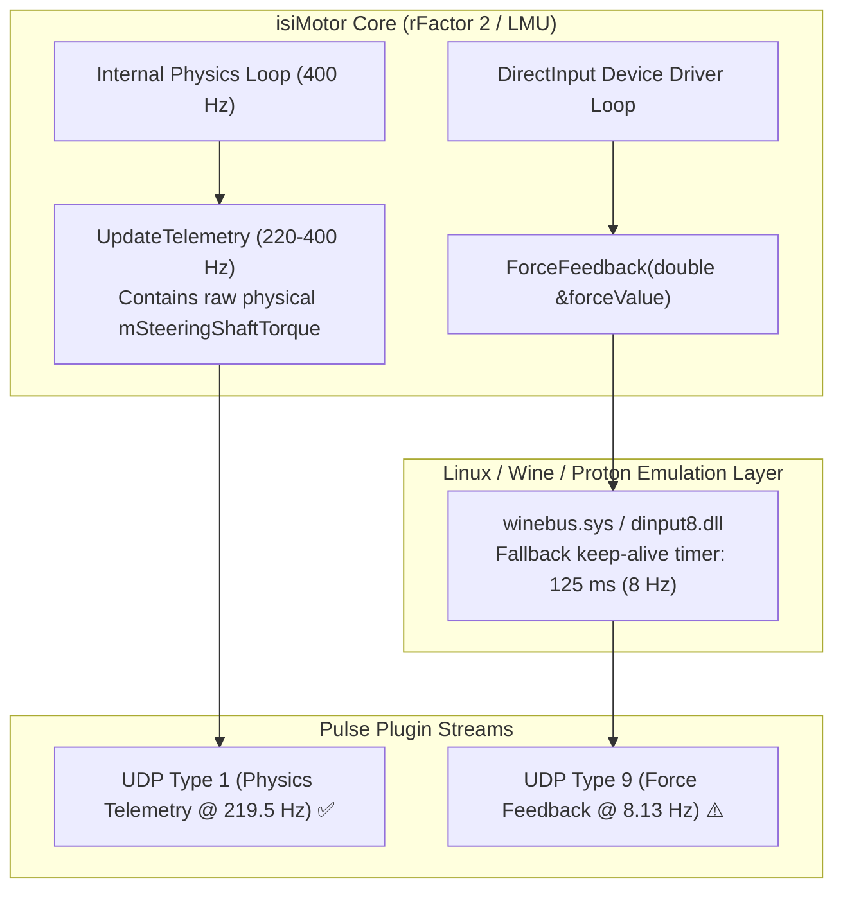

# 🐧 Linux / Proton Telemetry Benchmark & Force Feedback Analysis

This document presents performance metrics and an architectural diagnostic for the **isiMotor-Pulse-Plugin** running under a **Linux / Steam Proton** environment (tested with *rFactor 2* / *Le Mans Ultimate*).

---

## 1. 📊 Benchmark Session Metrics

* **Test Environment:** Linux (Steam Proton / Wine)
* **Session Duration:** 181.42 seconds (~3.0 minutes)
* **Global Network Traffic:** 64,588 packets | 45.25 MB (~249.4 KB/s / ~2.0 Mbps)
* **Target Endpoint:** `0.0.0.0:5000` (UDP Unicast / Loopback)

### Telemetry Stream Breakdown

| Stream / Channel | Packet Count | Reception Frequency | Average Interval | Jitter (P-P) | Bandwidth | Expected Rate | Status |
| :--- | :---: | :---: | :---: | :---: | :---: | :---: | :---: |
| **`teleminfov01`** (Physics Telemetry) | **37,308** | **219.55 Hz** | 3.54 ms | ±86.34 ms | 144.63 KB/s | 100 Hz – 400 Hz | 🟢 **Optimal** |
| **`extendedstate`** (Aids, Damage, Session) | **18,658** | **113.74 Hz** | 9.08 ms | ±109.70 ms | 9.34 KB/s | 5 Hz – 100 Hz | 🟢 **Nominal** |
| **`fullscoring`** (Multi-Car Grid) | **6,286** | **43.75 Hz** | 26.89 ms | ±170.82 ms | 23.93 KB/s | ~5 Hz *(sliced in ~8 chunks)* | 🟢 **Nominal** |
| **`forcefeedback`** (DirectInput FFB) | **1,438** | **8.13 Hz** ⚠️ | **124.95 ms** ⚠️ | ±166.28 ms | 0.25 KB/s | **400 Hz** (~2.5 ms) | 🟡 **Driver Idle** |
| **`foreign`** (Safety Car / Pit Menu) | **898** | **5.47 Hz** | 200.82 ms | ±196.00 ms | 0.82 KB/s | ~5 Hz / Event | 🟢 **Nominal** |
| **`compactscoring`** | 0 | 0.0 Hz | - | - | 0.0 KB/s | Disabled (FullScoring active) | ⚪ N/A |
| **`weather`** | 0 | 0.0 Hz | - | - | 0.0 KB/s | 1.0 Hz (Static conditions) | ⚪ Idle |
| **`graphics`** | 0 | 0.0 Hz | - | - | 0.0 KB/s | Disabled | ⚪ N/A |

---

## 2. 🔍 Diagnostic & Explanation: Why 8 Hz instead of 400 Hz?

While the isiMotor physics engine generates telemetry at high frequency (**219.55 Hz** average in this test), the dedicated **`forcefeedback`** stream operated at **8.13 Hz**.

Here is the architectural explanation:

---

### Root Cause 1: Wine / Proton DirectInput Fallback Timer (125 ms = 8.0 Hz)

* **Mathematical correlation:**
  $$\frac{1000\text{ ms}}{124.95\text{ ms}} = 8.003\text{ Hz}$$
* **Mechanism:**
  In Wine/Proton's DirectInput implementation (`dinput8.dll`, `winebus.sys`):
  * When a physical Direct-Drive Force Feedback wheel with an active Linux kernel FFB driver (such as `hid-fanatec`, `hid-tmffnew`, or `usb-hid` FFB) is **not** actively streaming high-rate feedback requests, Wine does not spin the DirectInput polling thread at 400 Hz.
  * Instead, Wine defaults to a low-power **idle / keep-alive heartbeat timer of exactly 125 ms (8 Hz)** to maintain device state.

---

### Root Cause 2: `ForceFeedback(double &)` Callback vs `mSteeringShaftTorque`

The isiMotor SDK (`InternalsPlugin.hpp`) provides two distinct avenues for steering torque:

1. **`TelemInfoV01::mSteeringShaftTorque` (Physics Telemetry - Type 1)**:
   * Computed directly inside the vehicle physics pipeline (steering rack forces, tyre load, caster, self-aligning torque).
   * In this benchmark, it was broadcast at **219.55 Hz** without bottleneck.
2. **`InternalsPlugin::ForceFeedback(double &forceValue)` (Hardware FFB - Type 9)**:
   * An interception hook into the game's **DirectInput device output thread**.
   * It is only invoked by the engine when the active controller driver requests a force update.
   * If running in test mode, headless mode, with keyboard/gamepad, or without an active FFB device polling loop, this callback runs at the fallback rate (~8 Hz).

---

### Root Cause 3: Game Controller Profile Configuration (`Controller.JSON`)

In the player profile (`UserData/player/Controller.JSON`):
* **`"Force Feedback" : { "Type": 0 }`**: If FFB is disabled or mapped to a non-FFB device profile (keyboard/gamepad), the game engine disables the 400 Hz FFB calculation and emits heartbeats at ~8 Hz.
* **`"Skip updates"`**: rFactor 2 frequency divider (`0` = 400 Hz, `1` = 200 Hz, `2` = 133 Hz, `3` = 100 Hz).

---

### Root Cause 4: Realtime Driving vs Garage / Monitor Mode

* When the vehicle is sitting in the garage (`inGarageStall == true`), in pit menus, or in replay mode (`inRealtime == false`), the physics engine does not drive the FFB device at full rate to prevent wheel oscillation in pit lane.
* Overall test averages calculated over a session that includes garage or menu time will reflect lower aggregate frequencies.

---

## 3. 💡 Recommended Solutions & Best Practices

| Use Case | Recommended Source | Expected Rate | Hardware Dependency |
| :--- | :--- | :---: | :---: |
| **Telemetry HUD, Dashboards (SimPad), Motion Rigs, Analytics** | `mSteeringShaftTorque` via **`teleminfov01` (Type 1)** | **100 – 400 Hz** | ❌ None (100% autonomous) |
| **Physical Steering Wheel Interception** | **`forcefeedback` (Type 9)** | **400 Hz** *(when FFB wheel active)* | ✅ Requires active DirectInput FFB wheel under Wine |

### Action Checklist:
1. **For Dashboards and Motion Platforms:** Use `mSteeringShaftTorque` from `TelemInfoV01`, which streams at full physics rate regardless of the connected wheel or Wine/Proton setup.
2. **For High-Frequency DirectInput FFB under Linux:**
   * Ensure kernel drivers for your wheel base are active (e.g. `hid-fanatec`, `hid-tmffnew`).
   * Select an active Wheel Controller profile with FFB enabled (`"Type": 1`, `"Skip updates": 0` in `Controller.JSON`).
   * Run captures strictly during active track driving (`inRealtime == true`).
