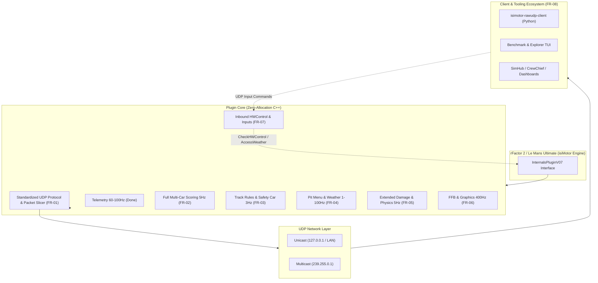
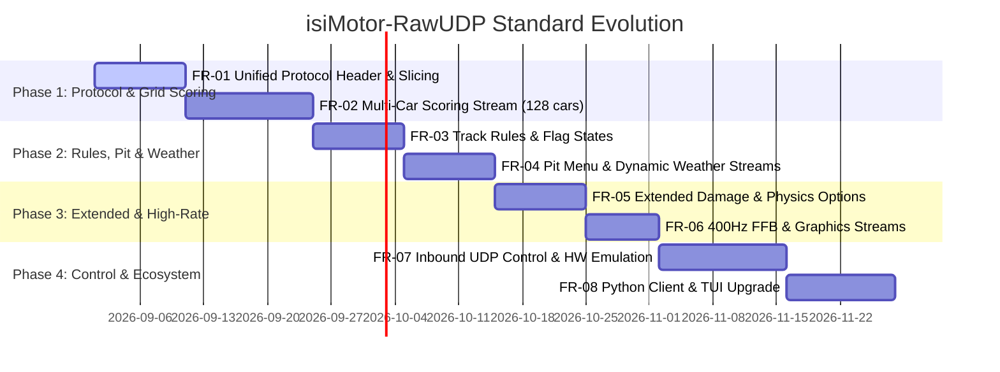

# isiMotor-RawUDP Roadmap to rF2SharedMemoryMapPlugin Standard

This document outlines the step-by-step engineering roadmap to elevate **`isiMotor-RawUDP-Plugin`** to full parity with the gold standard in the rFactor 2 / Le Mans Ultimate ecosystem: [**`rF2SharedMemoryMapPlugin`**](TARGET.md) (by *TheIronWolfModding* / *Vytautas Leonavičius*).

---

## 🎯 High-Level Objective

While `rF2SharedMemoryMapPlugin` uses Windows Memory-Mapped Files (requiring Wine bridges under Linux Proton and lacking native network streaming), `isiMotor-RawUDP-Plugin` provides a cross-platform, zero-allocation binary UDP stream.

To become the universal drop-in replacement across SimHub, Crew Chief, dashboards, motion platforms, and custom pit-wall tools, the plugin must support all data streams, structures, and two-way control mechanisms present in `rF2SharedMemoryMapPlugin`.

---

## 📋 Feature Request Breakdown

The migration is partitioned into 8 modular, step-by-step Feature Requests:

| ID | Feature Request | Status | Description |
|---|---|:---:|---|
| **[FR-01](FR-01_Protocol_Standardization_and_Header.md)** | **Protocol Standardization & Packet Framing** | 📝 Planned | Standardized packet header (`SIMP`), sequence numbering, stream IDs, and zero-allocation packet slicing for payloads exceeding MTU. |
| **[FR-02](FR-02_Multi_Vehicle_Scoring_and_Leaderboard.md)** | **Multi-Vehicle Scoring & Grid Leaderboard** | 📝 Planned | Full 128-vehicle grid scoring (`ScoringInfoV01` + `VehicleScoringInfoV01`), sector times, class rankings, gaps, and driver names. |
| **[FR-03](FR-03_Track_Rules_Flags_and_Safety_Car.md)** | **Track Rules, Flags & Safety Car State** | 📝 Planned | FCY, sector yellow flags, Safety Car position/speed, pit lane open/close rules, and rolling start frozen order tracking. |
| **[FR-04](FR-04_Pit_Menu_and_Weather_Streams.md)** | **Pit Menu State & Dynamic Weather Streams** | 📝 Planned | Real-time pit menu navigation buffer (`PitMenuV01` @ 100Hz) and ambient weather/track condition telemetry (`WeatherControlInfoV01`). |
| **[FR-05](FR-05_Extended_Buffer_Damage_and_Physics_Options.md)** | **Extended Damage, Physics Options & Transitions** | 📝 Planned | Accumulated component damage (aero, suspension, engine), physics aids (`PhysicsOptionsV01`), and session transition markers. |
| **[FR-06](FR-06_ForceFeedback_and_Graphics_Telemetry.md)** | **Force Feedback & Extended Graphics Telemetry** | 📝 Planned | Ultra high-rate (400Hz) steering torque / FFB output and camera/cockpit graphics stream (`GraphicsInfoV02`). |
| **[FR-07](FR-07_BiDirectional_Input_and_HW_Control.md)** | **Bi-Directional UDP Input & Hardware Control** | 📝 Planned | Inbound UDP command listener for pit menu navigation (`CheckHWControl`), vehicle controls (ignition, wipers, TC/ABS), and weather injection. |
| **[FR-08](FR-08_Client_Ecosystem_and_TUI_Evolutions.md)** | **Python Client & TUI Dashboard Evolution** | 📝 Planned | Full asynchronous decoders, command sender APIs for `isimotor-rawudp-client`, and enhanced multi-tab Textual TUI inspector. |

---

## 🗺️ Step-by-Step Implementation Roadmap

---

## 📊 Parity Matrix Comparison

| Feature / Buffer | `rF2SharedMemoryMapPlugin` (v3.7.x) | Current `isiMotor-RawUDP` | Target `isiMotor-RawUDP` (After Roadmap) |
|---|---|---|---|
| **Transport** | Windows Memory Mapped Files (`CreateFileMapping`) | Native Raw UDP Socket | Native Raw UDP Socket (LAN/Wi-Fi/Loopback) |
| **Linux/Proton** | Requires Wine DLL bridge & background daemon | 100% Native & Transparent | 100% Native & Transparent |
| **Telemetry (`TelemInfoV01`)** | ✅ 50Hz (Buffer Version Sync) | ✅ 60-100Hz (Raw/Throttled) | ✅ 60-100Hz + Seq Counter |
| **Scoring Grid** | ✅ Up to 128 vehicles (Full) | ⚠️ Player-only (168B compact) | ✅ Full 128 cars + Sliced UDP packets |
| **Track Rules / Flags** | ✅ `rF2Rules` + `MultiRules` (3Hz) | ❌ Not implemented | ✅ `TrackRulesV01` + `MultiSessionRulesV01` |
| **Pit Menu State** | ✅ `rF2PitInfo` (100Hz) | ❌ Not implemented | ✅ `PitMenuV01` (100Hz) |
| **Weather Telemetry** | ✅ `rF2Weather` (1Hz) | ❌ Not implemented | ✅ `WeatherControlInfoV01` (1Hz) |
| **Extended Damage & Physics** | ✅ `rF2Extended` + Damage tracking | ❌ Not implemented | ✅ Accumulated damage + `PhysicsOptionsV01` |
| **Force Feedback (FFB)** | ✅ `rF2ForceFeedback` (400Hz) | ❌ Not implemented | ✅ 400Hz High-rate FFB Stream |
| **Graphics Info** | ✅ `rF2Graphics` (400Hz) | ❌ Not implemented | ✅ `GraphicsInfoV02` Stream |
| **HW / Pit Input Control** | ✅ `rF2HWControl` Input Buffer | ❌ Not implemented | ✅ Inbound UDP Command Receiver |
| **Weather Input Control** | ✅ `rF2WeatherControl` Input Buffer | ❌ Not implemented | ✅ Inbound Weather UDP Packet |
| **Python Client Library** | C# MappedBuffer only | ✅ `isimotor-rawudp-client` | ✅ Full multi-stream async client + API |
| **Live Visualizer** | C# WinForms Monitor app | ✅ Textual TUI Benchmark | ✅ Multi-panel live TUI dashboard |
